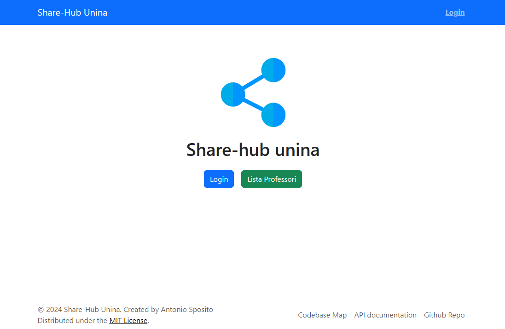
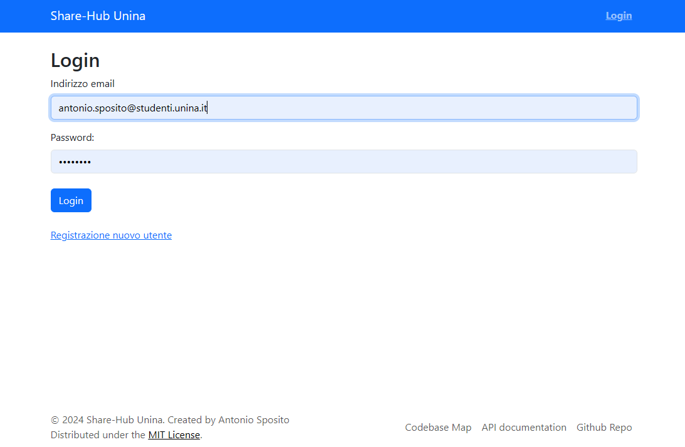
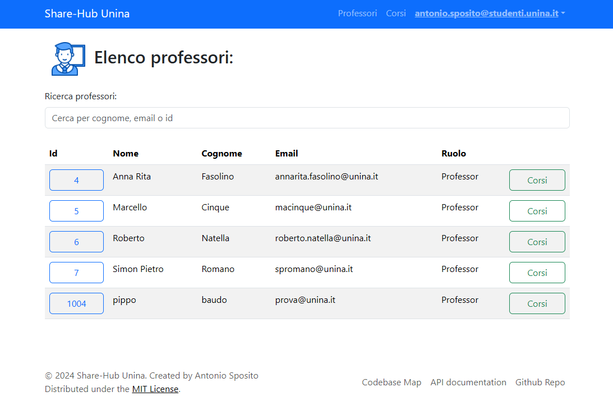
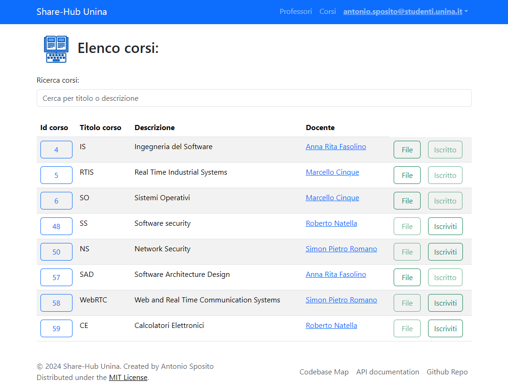
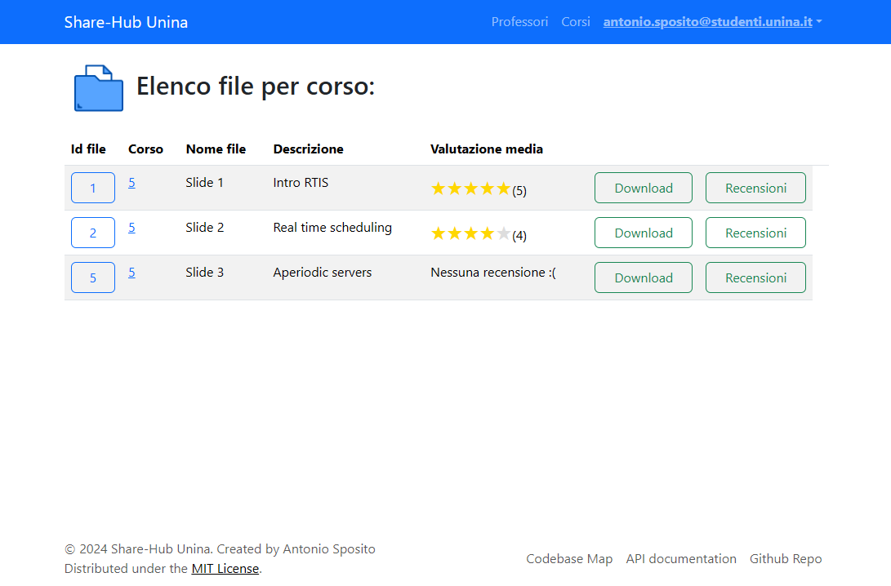
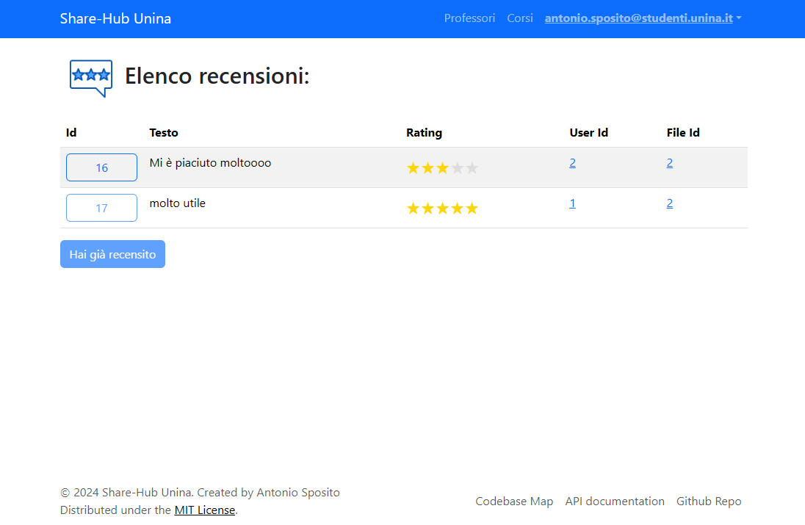

<p align="center"></p>

# Share Hub Unina

Share-Hub Unina è un’ applicazione web sviluppata per il corso di Software Architecture Design. La webapp mette a disposizione degli utenti una piattaforma dove i professori possono caricare del materiale didattico per i loro corsi mentre gli studenti possono, dopo essersi iscritti ai corsi, scaricarne il materiale didattico e recensire i singoli file per poter condividere con altri studenti le loro opinioni sui file.

<details>
<summary>Immagini dell'applicazione</summary>








</details>

## Installazione

Prima di procedere all'installazione, si consiglia la lettura della documentazione, accessibile in questa repo.

```bash
$ git clone https://github.com/AntonioSposito/share-hub-unina.git
$ cd share-hub-unina
$ npm install
$ cd .\apps\api\
$ npx prisma generate
```

## Dev mode

Lancio dell'app in watch mode, due server in parallelo per frontend e backend rispettivamente.

```bash
# development watch mode
$ npm run dev
```

Durante la fase di sviluppo, l'applicazione è gestita da due server separati:

-   **Frontend**: React espone il frontend su http://localhost:5173, servito da Vite
-   **Backend**: NestJS che espone gli API endpoints su http://localhost:3000, servito da Webpack server. All’interno del backend è contenuto anche il database SQlite.

Sia Vite che Webpack monitorano il codice per dei cambiamenti e aggiornano automaticamente frontend/backend durante lo sviluppo.

La comunicazione tra il frontend e il backend avviene tramite un API proxy configurato in Vite, che semplifica le richieste evitando problemi di CORS. Questo setup consente uno sviluppo separato e parallelo dei due ambienti, facilitando l'iterazione rapida. L'uso di Turbo permette di coordinare il progetto monorepo, gestendo efficacemente entrambe le applicazioni in modo sincrono, con build parallele e migliorando i tempi di sviluppo.

## Production mode

In fase di produzione, l'intero sistema viene consolidato su un singolo server **NodeJS** su http://localhost:3000 senza Webpack. Il backend gestisce le API, mentre il frontend, compilato come risorse statiche da Vite, viene servito dallo stesso server NestJS. In questo modo, NestJS si occupa sia della logica server-side che della distribuzione del frontend, semplificando l'infrastruttura e migliorando l'efficienza.

```bash
# production mode
$ npm run build
$ npm run start
```

## Licenza

Share-Hub Unina è [MIT licensed](LICENSE).
